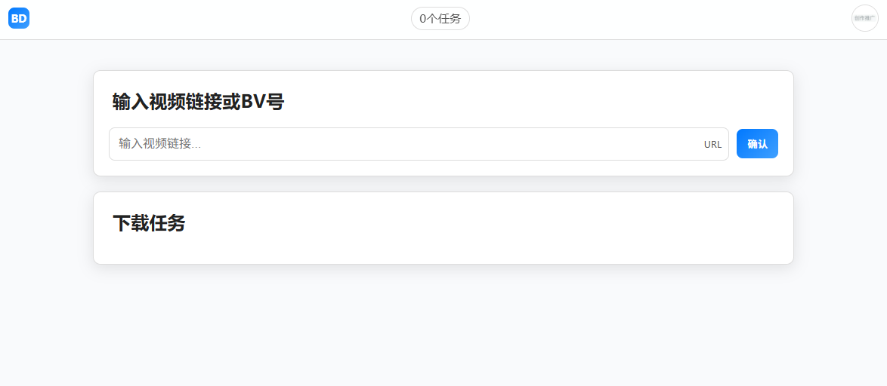

# bilibili-downloader
开箱即用的 BiliBili 下载器  
本项目是一个基于 Node.js 和 Electron 构建的跨平台BiliBili下载工具，支持所有主流操作系统。

## ⚡ 快速体验

### Windows
从 Release 中下载 bilibili.Setup.x.x.x.exe 后执行正常安装流程即可 (可能被折叠)
  
Windows 现仅支持 X64，理论可在ARM64上转译运行，暂无设备测试

### Linux
#### 从 Release 中下载支持的发行版包，目前支持：
rpm  
deb  
AppImage  
#### Linux支持多种架构
amd64  
arm64  
armv7l（仅 AppImage）

### Mac
MAC 版本无签名，需要命令行处理或从本地开发环境运行
#### 从Release下载并使用命令行处理
下载ZIP软件包，方便后续处理  
注意区分Intel版和AppleSilicon（ARM64）版本  
解压ZIP获取.app包  
使用命令行去除互联网下载标签  
移入Application并且开始使用
#### 从本地开发环境运行
见教程

## 🚀 本地开发环境运行指南
### 🛠️ 环境准备 (Prerequisites)
在开始之前，请确保你的开发环境已安装以下软件：

* **Node.js**: 推荐使用 [LTS 版本](https://nodejs.org/) (v22.x)。
* **Git**: 用于克隆项目仓库。（可选从Github下载ZIP）

## 🐞 Bug、意见反馈和帮助
### Bug
使用Issue并添加 bug TAG
### 功能意见
使用Issue并添加 enhancement TAG
### 需要帮助
使用Discussion功能发布帮助请求
#
**额外申明**  
该项目仅供学习研究使用，请勿用于非法用途  
项目仅用于可用BiliBili客户端下载的视频，不支持版权内容的下载  
联系删除：contact@5share.site